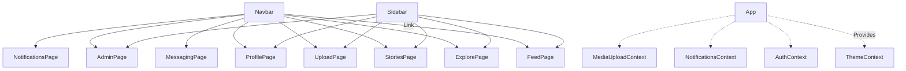

# AuraSphere Architecture

This document details the folder structure, routing, core navigation logic, and architectural foundations of AuraSphere. It also provides concrete recommendations and stepwise next actions for continuing implementation.

---

## 1. Folder and File Structure

```
aura_sphere/
├── README.md
├── eslint.config.mjs
├── package.json
├── post_process_status.lock
└── src/
    ├── App.js
    ├── App.css
    ├── index.js
    ├── index.css
    ├── setupTests.js
    ├── components/
    │   ├── Navbar.js
    │   └── Sidebar.js
    ├── context/
    │   └── ThemeContext.js
    └── features/
        ├── Admin/
        │   ├── Page.js
        │   └── index.js
        ├── Auth/
        │   ├── AuthContext.js
        │   ├── Page.js
        │   └── index.js
        ├── Explore/
        │   ├── Page.js
        │   └── index.js
        ├── Feed/
        │   ├── Page.js
        │   └── index.js
        ├── MediaUpload/
        │   ├── MediaUploadContext.js
        │   ├── Page.js
        │   └── index.js
        ├── Messaging/
        │   ├── Page.js
        │   └── index.js
        ├── Notifications/
        │   ├── NotificationsContext.js
        │   ├── Page.js
        │   └── index.js
        ├── Profile/
        │   ├── Page.js
        │   └── index.js
        └── Stories/
            ├── Page.js
            └── index.js
```

### Component & Feature Philosophy

- **components/** 
  - Reusable UI blocks that appear across the app (e.g., Navbar, Sidebar).
- **features/** 
  - Each subfolder encapsulates a user-facing feature/page, usually with a `Page.js` (currently a stub component).
  - Some features include context/provider files for scoped state (e.g., AuthContext, MediaUploadContext, NotificationsContext).

- **context/**
  - Global contexts (currently only Theme, dark/light mode stub).

---

## 2. Navigation and Routing Overview

**Routing** is managed via React Router in `src/App.js`:

- Main `<App />` uses `<BrowserRouter>`, and contains:
  - `<Navbar />` at the top (always visible, handles top nav and mobile menu)
  - `<Sidebar />` at the left (visible on desktop, hidden on mobile <900px)
  - `<main>` element for page routing/content
  - CSS is used for responsive breakpoints—sidebar collapses on mobile; menu swaps to hamburger.

- **Routes:**
  - `/`, `/feed` → FeedPage
  - `/explore` → ExplorePage
  - `/stories` → StoriesPage
  - `/messaging` → MessagingPage
  - `/admin` → AdminPage
  - `/notifications` → NotificationsPage
  - `/profile` → ProfilePage
  - `/media-upload` → MediaUploadPage
  - `/auth` → AuthPage

**Navigation logic**:
- The **Navbar** holds all primary navigation links. On small screens, these collapse into a hamburger menu.
- The **Sidebar** provides quick access to core pages (Feed, Explore, Upload, etc.) and highlights active route; only visible on tablets/desktops.

---

## 3. Architectural Stubs and Extensibility

- **ThemeContext**: Global dark/light mode toggle. Stub only; real logic to follow.
- **AuthContext**: Minimal auth state. Integrate Firebase/Auth0 or alternative.
- **NotificationsContext**: Notification queue/management stub.
- **MediaUploadContext**: Tracks upload state, to be tied to storage backend.
- **Each Page**: All `Page.js` files in features/ are "stubs"—minimal component, intended to be filled out per feature (feed display, profile management, etc.).

---

## 4. Recommendations & Concrete Next Steps

**a. Authentication**  
  - Implement real sign-in/sign-up flows in `AuthContext.js` and AuthPage (Firebase Auth, Auth0, or similar).

**b. Feed, Explore, Profile, Stories, Messaging**  
  - Expand current stub components into full pages.  
  - Build out UIs and connect to backend services as available.
  - Implement real-time data (sockets, Firestore, etc.) for messaging and stories.

**c. Media Upload**  
  - Wire up `MediaUploadContext` to image/video upload service (Firebase Storage or Cloudinary).
  - Add upload progress UI, drag/drop support, and file validation.

**d. Notifications & Engagement**  
  - Implement notification logic in `NotificationsContext.js`
  - Design push notification UX.

**e. Theming**  
  - Expand ThemeContext to control and persist user-selected themes, including animated mood-based color schemes.

**f. State Management**  
  - As complexity grows, consider integrating Redux or Zustand for cross-feature state (not needed yet).

**g. UI/UX Polish**  
  - Add touch gestures, transitions, and mood-based animation.
  - Make profile theming and admin panel interactive.

---

## 5. Architectural Diagram



---

For further implementation details, see the code comments within each context and page stub.
